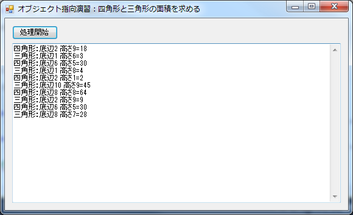

# オブジェクト指向プログラミングの演習用リポジトリ
オブジェクト指向プログラミングにおいて、以下の項目の習得をするための演習問題です。

1. 新規クラスの作成
- クラスの設計：既存のプログラムを分析して、クラスを作成する
- 親クラスと子クラスを設計する
- アクセス子(public, protected, private)を適切に設定する
- 自らの配列の処理は自ら行う(static)
- ポリモーフィズムで分岐処理と配列を簡単にする

このリポジトリをForkして、手順に従って解答してください。
指示通りに作業するのではなく、これまでの資料やインターネットの情報を活用して、
自ら問題を解決してください。周りの人と相談しても構いません。

# 作成するプログラム

- ボタンが１つと、複数行のTextBoxが１つ配置されたフォームを持つ
- 起動時に、任意の数の四角形と三角形を生成して、それぞれ、底辺と高さを1～10の乱数で求める
- ボタンを押すと、生成した四角形と三角形の面積を求めて、TextBoxに出力する

# 作業準備
1. GitHubにサインインする
- このリポジトリをフォーク(Fork)する
- GitHub Desktopを起動
- 左上の[+]を押して、[Clone]を選択

